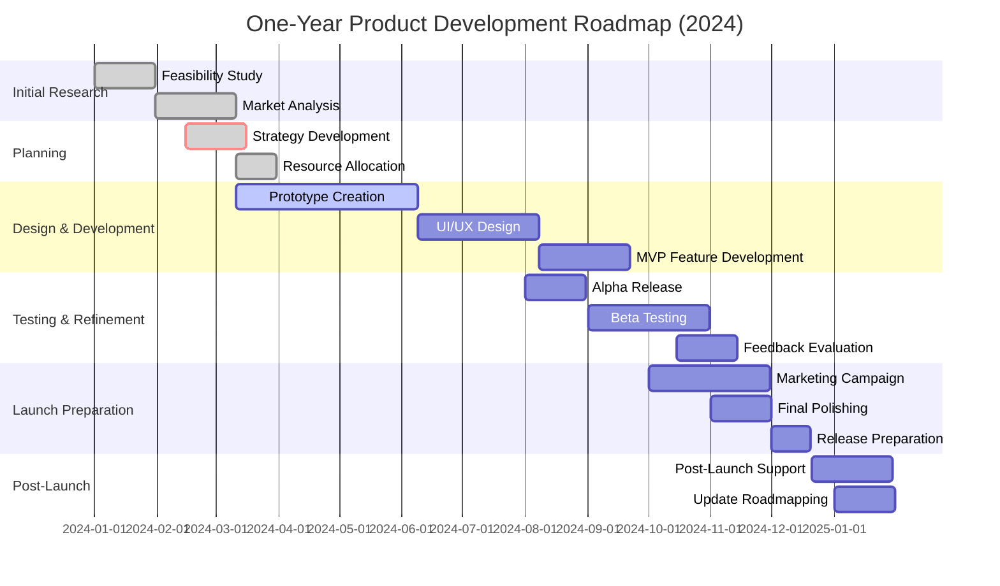

# www.dialogsync.com

+ solution
+ usage
+ examples

## DialogSync Solution

MD File format with attached structure of files, exchange in both sides
+ From File Structure to Markdown File Content, **documenting a file system structure**
+ From Markdown File to File Structure in a Git Project, **interpreting documentation to structure a Git project**


### Roadmap

A **roadmap** outlines the specific steps and milestones to develop the solution over time:

1. **Initial Research and Feasibility Study** - Assess the current market needs and technical possibilities.
2. **Prototype Development** - Create basic scripts to convert file structures to Markdown and back.
3. **User Interface Design** - Introduce a user-friendly interface to simplify operations for non-technical users.
4. **Feature Expansion** - Add support for advanced functionalities like nested structures, linking, and Git integration.
5. **Alpha/Beta Testing** - Conduct user testing to gather feedback and refine the tool.
6. **Product Launch** - Release the first official version of the solution to the market.
7. **Post-Launch Support and Updates** - Provide customer support, fix bugs, and release updates based on user feedback.
8. **Further Integrations and Extensions** - Develop plugins or add-ons to integrate with other tools and platforms.

### Mission

A **mission** statement defines the purpose of the solution and the immediate goals it aims to achieve:

"Our mission is to streamline and automate the documentation process for developers and content creators, enabling them to quickly synchronize file structures with their corresponding Markdown documentation, thus saving time and reducing manual errors."

### Vision

A **vision** statement describes the long-term impact and aspirations of the solution:

"Our vision is to become the leading solution in the field of documentation automation, empowering developers to focus on creation rather than administration and helping them maintain high-quality, accurate, and easily navigable project documentation."

### Motto

A **motto** is a memorable catchphrase that summarizes the spirit and benefits of the solution:

"Structure Your Thoughts, Document with Precision."

When formulating these strategic elements, make sure they are specific to your solution's features, user benefits, and the values of your organization. Aim for clarity, motivation, and alignment with the long-term strategy of your product or service.


The description you provide suggests two distinct operations involving Markdown:

1. Converting a file system structure into the content of a Markdown file.
2. Interpreting the content of a Markdown file to replicate a file system structure within a Git project.

These operations sound like they would be part of a documentation system, where you're either documenting a file structure or you're using a document as a blueprint to create a structure.

Here's how you might call these operations and achieve them:

### 1. From File Structure to Markdown File Content

This operation is often referred to as **documenting a file system structure**. 

Bash script that traverses a directory structure and prints it as a Markdown-style list:

```bash
#!/bin/bash

# Function to recursively print directory structure
print_structure () {
    local folder="$1"
    local indent="$2"
    for file in "$folder"/*; do
        # Print indentation and filename
        echo "${indent}- $(basename "$file")"
        # If the file is a directory, recurse with increased indentation
        if [ -d "$file" ]; then
            print_structure "$file" "  $indent"
        fi
    done
}

# Start the recursive print from root directory
print_structure "/path/to/your/folder" ""
```

### 2. From Markdown File to File Structure in a Git Project

There isn't a standard utility for **interpreting documentation to structure a Git project**,

Script or use specialized software to parse the Markdown and create directories and files accordingly:


```python
import os
import re

def create_structure_from_md(md_path, base_path):
    with open(md_path, 'r') as md_file:
        lines = md_file.readlines()

    indent_level = 0
    path_stack = [base_path]

    # Regex to detect markdown list items with the correct indentation
    item_regex = re.compile(r'^(  )*[-*]\s+(.+)')

    for line in lines:
        match = item_regex.match(line)
        if match:
            current_indent = len(match.group(1)) // 2 if match.group(1) else 0
            item_name = match.group(2).strip()
            # Adjust the path stack based on indent level
            while current_indent < indent_level:
                path_stack.pop()
                indent_level -= 1
            # Add new directory or file
            if current_indent == indent_level:
                path_stack.pop()
            new_path = os.path.join(*path_stack, item_name)
            if not os.path.exists(new_path):
                os.makedirs(new_path)  # Creates intermediate directories as required
            path_stack.append(new_path)
            indent_level = current_indent

create_structure_from_md('path/to/markdown.md', 'path/to/git/project')
```


### Roadmap

A **roadmap** outlines the specific steps and milestones to develop the solution over time:

1. **Initial Research and Feasibility Study** - Assess the current market needs and technical possibilities.
2. **Prototype Development** - Create basic scripts to convert file structures to Markdown and back.
3. **User Interface Design** - Introduce a user-friendly interface to simplify operations for non-technical users.
4. **Feature Expansion** - Add support for advanced functionalities like nested structures, linking, and Git integration.
5. **Alpha/Beta Testing** - Conduct user testing to gather feedback and refine the tool.
6. **Product Launch** - Release the first official version of the solution to the market.
7. **Post-Launch Support and Updates** - Provide customer support, fix bugs, and release updates based on user feedback.
8. **Further Integrations and Extensions** - Develop plugins or add-ons to integrate with other tools and platforms.





### Mission

A **mission** statement defines the purpose of the solution and the immediate goals it aims to achieve:

"Our mission is to streamline and automate the documentation process for developers and content creators, enabling them to quickly synchronize file structures with their corresponding Markdown documentation, thus saving time and reducing manual errors."

### Vision

A **vision** statement describes the long-term impact and aspirations of the solution:

"Our vision is to become the leading solution in the field of documentation automation, empowering developers to focus on creation rather than administration and helping them maintain high-quality, accurate, and easily navigable project documentation."

### Motto

A **motto** is a memorable catchphrase that summarizes the spirit and benefits of the solution:

"Structure Your Thoughts, Document with Precision."

When formulating these strategic elements, make sure they are specific to your solution's features, user benefits, and the values of your organization. Aim for clarity, motivation, and alignment with the long-term strategy of your product or service.
